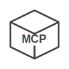

<p align="center">
  <picture>
    <source media="(prefers-color-scheme: dark)" srcset="assets/logo-dark.svg">
    
  </picture>
  <br>
  <a href="https://www.npmjs.com/package/mcpbox"></a>
</p>

**MCPBox** is a lightweight gateway that exposes local stdio-based [MCP](https://modelcontextprotocol.io) servers via Streamable HTTP, enabling Claude and other AI agents to connect from anywhere.

- Runs multiple servers behind a single HTTP endpoint
- Supports Tools, Resources & Prompts
- Namespaces with `servername__` prefix to avoid collisions
- Per-server tool filtering to limit AI access and reduce context usage
- OAuth 2.1, API key, or no auth

<picture>
  <source media="(prefers-color-scheme: dark)" srcset="assets/diagram-dark.excalidraw.png">
  
</picture>

## Quick Start

Create `mcpbox.json`:

```json
{
  "mcpServers": {
    "memory": {
      "command": "npx",
      "args": ["-y", "@modelcontextprotocol/server-memory"]
    },
    "sequential-thinking": {
      "command": "npx",
      "args": ["-y", "@modelcontextprotocol/server-sequential-thinking"]
    }
  }
}
```

Run:

```bash
npx mcpbox
```

Add to your MCP client config:

```json
{
  "mcpServers": {
    "mcpbox": {
      "url": "http://localhost:8080"
    }
  }
}
```

## Documentation

See the [documentation](https://kandobyte.github.io/mcpbox/quick-start) for configuration, authentication, deployment, and connecting clients.
